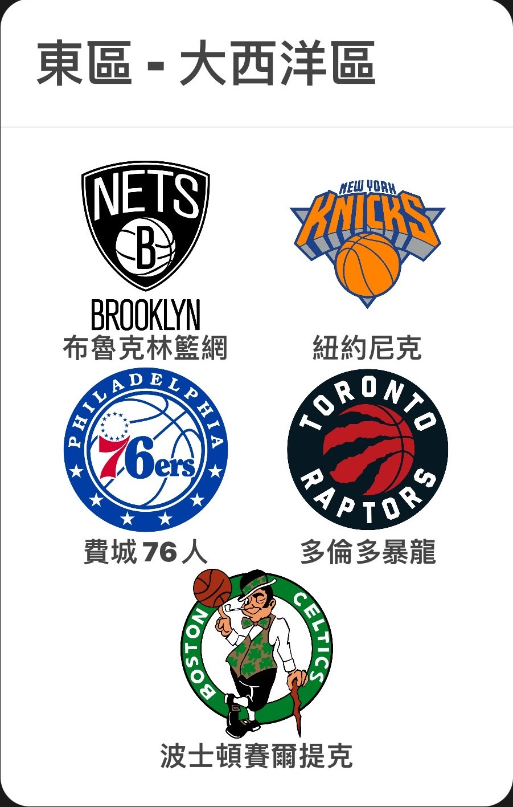
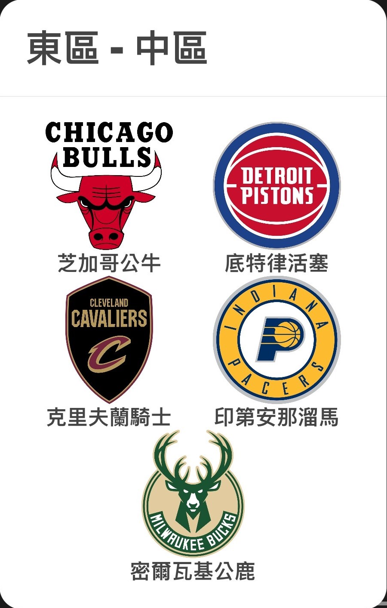
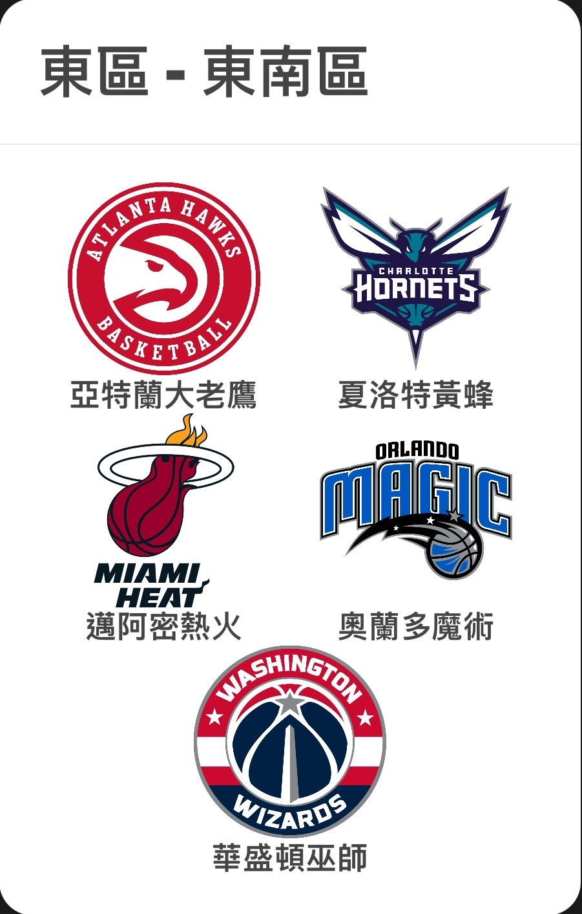
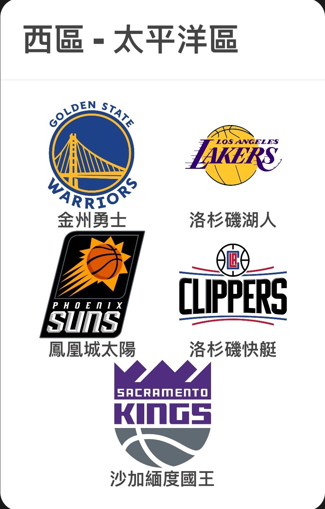
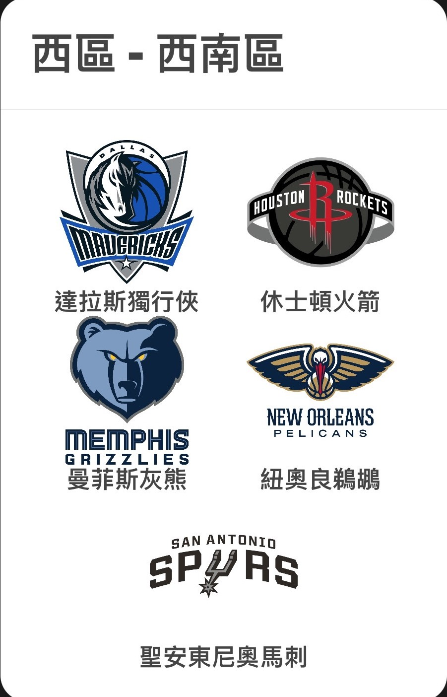
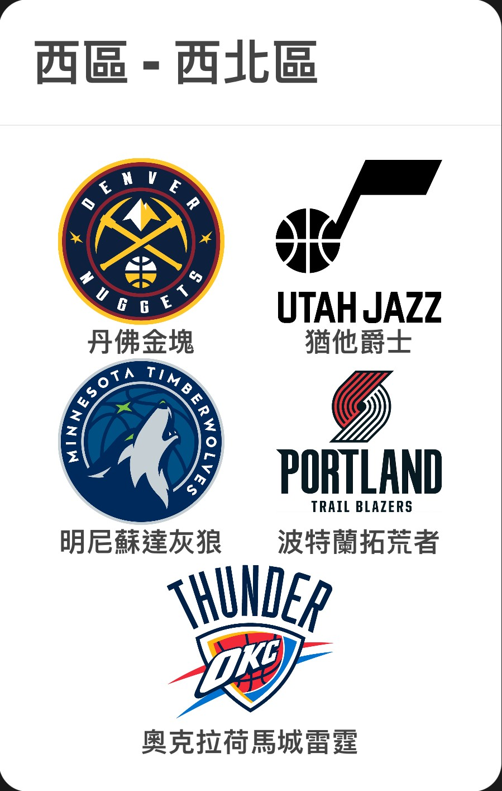
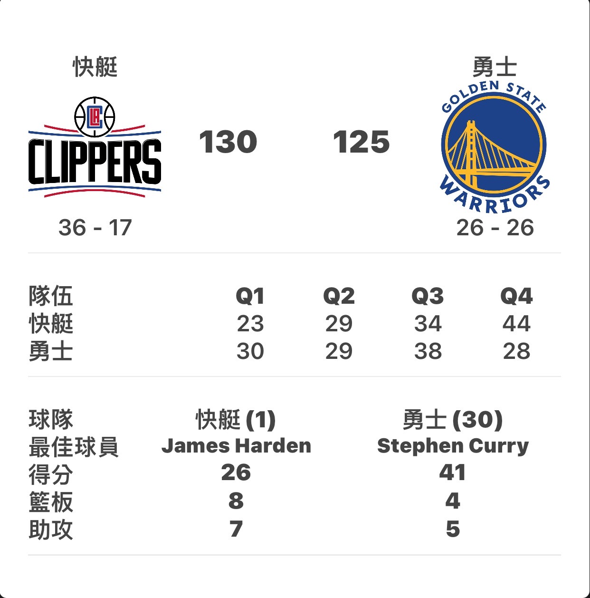
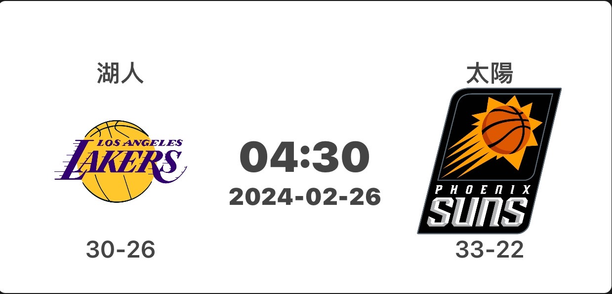

# NBA-linebot

## Project Overview:
NBA-linebot is a Line chatbot designed to provide users with quick access to NBA game scores. Users can inquire about the day's match results, and the chatbot will present the information through Flex Messages.The application is built using the Flask framework.

## Features:
1. **Check Today's Scores:**
   - Users can inquire about the day's NBA game scores.

2. **Detailed Flex Messages:**
   - Upon clicking the "查詢戰績" option, users are presented with an team Flex Message.
   -      

3. **Team-Specific Information:**
   - Users can select a specific team to get detailed information about their recent games.
   - 
   
4. **Get Latest Game:**
   - If the selected team has no ongoing or recent games, the chatbot will display information about the team's latest match.
   - 

5. **Expense Tracking**
   - Users can record their income and expenses related to sports betting directly through the chatbot.

## Deployment:
The application is deployed on **Render**, and the following environment variables need to be configured:
- `ACCESS_TOKEN`: Obtain this from LINE Developers.
- `CHANNEL_SECRET`: Obtain this from LINE Developers.
- `JSON_FILE_NAME`: Obtain this from the Google Cloud Console.
   - Visit the Google Cloud Console and create a service account.
   - Download the JSON key file associated with the service account.
   - Upload the JSON key file to your Render project as a secret file.
   - Set the value of `JSON_FILE_NAME` to the name of the uploaded JSON key file.
- `SPREAD_SHEET_KEY`: Retrieve this from your Google Sheets document.
   - Open your Google Sheets document.
   - Extract the key from the document's URL, which is the string between `/d/` and `/edit`.
        - Example URL: `https://docs.google.com/spreadsheets/d/a1b2c3d4e5f6g7h8i9j10/edit`
        - Set the value of `SPREAD_SHEET_KEY ` to `a1b2c3d4e5f6g7h8i9j10`.

Ensure that these environment variables are correctly set for the proper functioning of the application.

Additionally, make sure that the JSON_FILE_NAME secret file is uploaded to your Render project.

## How to Use:
1. **NBA Game Scores:**
   - Open the chat with the NBA-linebot on your LINE application.
   - Type or click to inquire about today's NBA game scores.
   - Navigate through the Flex Messages to explore specific team information.

2. **Expense Tracking (for Sports Betting Enthusiasts):**
   - Utilize the chatbot to record your income and expenses related to sports betting.
   - Commands:
     - `+ [amount]`: Record income. Example: `+ 1000`.
     - `- [amount]`: Record expenses. Example: `- 500`.
     - `盈餘`: Check your total profit.
   - The recorded data is seamlessly connected to your Google Sheet, providing an efficient way to manage your finances.

3. **Google Sheet Integration:**
   - Access your Google Sheet to view detailed financial records and calculated profits.
   - For the `JSON_FILE_NAME` environment variable, upload the JSON key file associated with your Google Cloud Console service account as a secret file on Render.
   - Ensure that the `SPREAD_SHEET_KEY` environment variable is set to your Google Sheets document key.

4. **Enjoy the Chatbot:**
   - Engage with the chatbot for NBA updates and effortlessly manage your sports betting finances.

Explore the various features and make the most out of the NBA-linebot for both entertainment and financial tracking.

## Note:
For the correct functioning of the chatbot, ensure that the environment variables are correctly set up.
